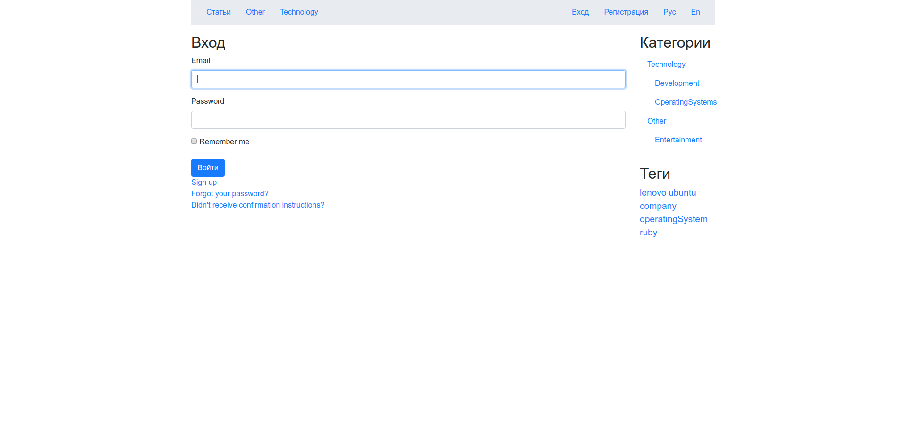

# FIRST BLOG ON RUBY ON RAILS

I watch the lessons and study to create a blog.

Goals:

* Implement basic functionality

* Create a design (Bootstrap, styles)

* Implement input validation

* Use flash

* Add localization, switching

* Add pictures (Carrierwave)

* Connect text editor

* Add Tags

* Add comments (DISQUS)

* Implement navigation

* Add categories and menu

* Implement user registration

* Add admin panel

* Correct mistakes

***

* English localization

* Russian localization

* Category

* Login In

* Admin panel

* Creating a new article

